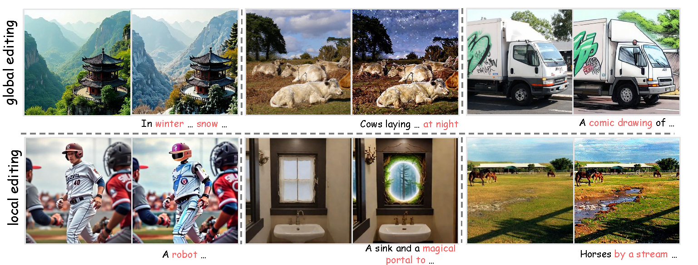
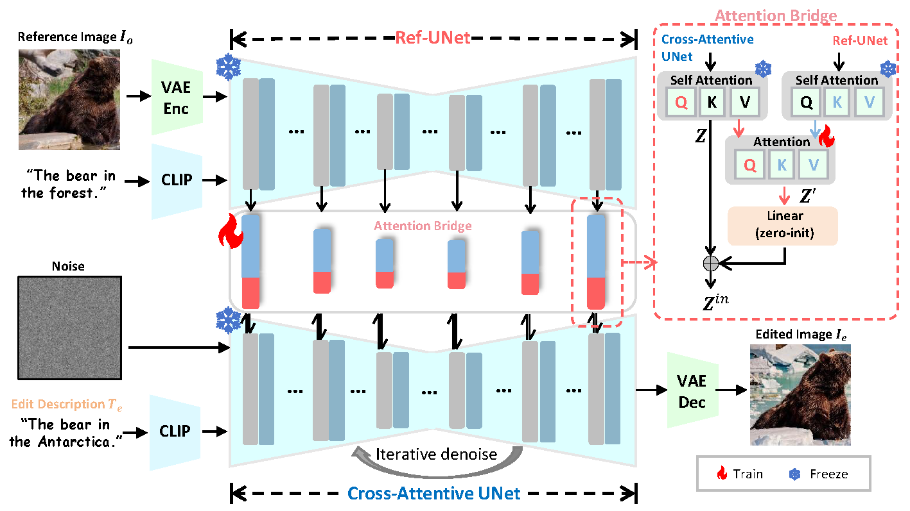

# ICCV 2025 | Describe, Don’t Dictate: Semantic Image Editing with Natural Language Intent

<a href='https://arxiv.org/abs/2508.20505'></a>
<a href='https://twinkle-ce.github.io/DescriptiveEdit/'></a>



Despite the progress in text-to-image generation, semantic image editing remains a challenge. Inversion-based algorithms unavoidably introduce reconstruction errors, while instruction-based models mainly suffer from limited dataset quality and scale. To address these problems, we propose a descriptive-prompt-based editing framework, named DescriptiveEdit. The core idea is to re-frame 'instruction-based image editing' as `reference-image-based text-to-image generation', which preserves the generative power of well-trained Text-to-Image models without architectural modifications or inversion. Specifically, taking the reference image and a prompt as input, we introduce a Cross-Attentive UNet, which newly adds attention bridges to inject reference image features into the prompt-to-edit-image generation process. Owing to its text-to-image nature, DescriptiveEdit overcomes limitations in instruction dataset quality, integrates seamlessly with ControlNet, IP-Adapter, and other extensions, and is more scalable. Experiments on the Emu Edit benchmark show it improves editing accuracy and consistency.


## 💡  Methodology



<b>Overview of the DescriptiveEdit framework.</b> We propose a novel image editing framework that reinterprets the role of text guidance by transitioning from instruction-based to description-driven editing. Instead of modifying diffusion model architectures or requiring additional training on instruction-labeled datasets, DescriptiveEdit leverages pre-trained text-to-image models in a plug-and-play manner, preserving their original generative capacity. To achieve this, we introduce a Cross-Attentive UNet, which injects reference image features into the denoising process via a lightweight attention bridge. This mechanism enables the model to align the edited output with the structural and semantic cues of the original image, while ensuring faithful adherence to the descriptive prompt. Moreover, instead of modifying the model's core architecture, we apply low-rank parameter tuning (LoRA), enabling parameter-efficient adaptation without disrupting the pre-trained generative capabilities.


## ⏱️ News

- __[2025.10]__: DescriptiveEdit code has been released!

- __[2025.06]__: DescriptiveEdit has been accepted by ICCV2025.

## 🛠️ Installation
We implemented this project using Python 3.10 with PyTorch 2.4.1. While the main experiments were conducted on H20 GPUs, some experiments were also run on L40s and A100 hardware.

Clone this repo and build up a new environment: 
```
cd DescriptiveEdit
bash setup_env.sh
```
## Data & Model Preparation

### 1️⃣ Dataset Download & Processing

- Download the image editing dataset(e.g. UltraEdit) from [Hugging Face](https://huggingface.co/).
```bash
huggingface-cli download --repo-type dataset <DATASET_NAME> --local-dir /path/to/dataset
```
- Prepare the Dataset.
```bash
cd data
python prepare_dataset.py
```
- Use an MLLM to generate image descriptions. This step not only enhanced the quality of the dataset, but also implicitly empowered the MLLM's core understanding capability to anticipate and interpret instructions for subsequent generation tasks.
  We use an internal API for this step, so you may need to adjust the code or API calls according to your own setup.  
```bash
cd data
python generate_description.py
```

### 2️⃣ Model Download

This project requires the `stable-diffusion-v1-5` base model. Download it from Hugging Face:

```bash
huggingface-cli download runwayml/stable-diffusion-v1-5 --local-dir ./models/stable-diffusion-v1-5
```

## 🚀 Training
To train the DescribeEdit, run:
```bash
accelerate launch train_joint_attention_lora.py
```
Multi-GPU training is supported by default. 
Modify configs in `configs/train.yaml` as needed.

## 🧨 Inference
To test the DescribeEdit, run:
```bash
python test_joint_attention_lora.py
```
For Gradio demo, run:
```bash
python app.py
```
## 💌 Acknowledgement

We thank [Diffusers](https://github.com/huggingface/diffusers.git) for their excellent open-source work.

# 📖BibTeX

If you find this work useful for your research and applications, please cite us using this BibTeX:
```
@InProceedings{Ci_2025_ICCV,
    author    = {Ci, En and Guan, Shanyan and Ge, Yanhao and Zhang, Yilin and Li, Wei and Zhang, Zhenyu and Yang, Jian and Tai, Ying},
    title     = {Describe, Don't Dictate: Semantic Image Editing with Natural Language Intent},
    booktitle = {Proceedings of the IEEE/CVF International Conference on Computer Vision (ICCV)},
    month     = {October},
    year      = {2025},
    pages     = {19185-19194}
}
```
